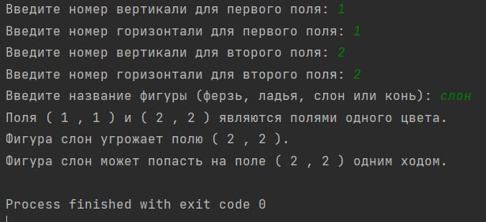
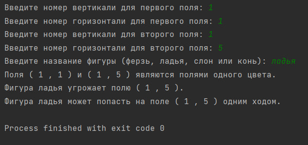

# **Лабораторная работа №3**
#### Лабораторные работы по прикладному программированию

# **Исполнитель**
#### Шевцов Михаил
#### Группа ФТ-220007

#### *Задание 1:*

##### Написать на любом языке программу решения поставеленных задач:
#### Даны натуральные числа k, l, m, n,
#### каждое из которых не превосходит восьми.
#### Требуется:
#### а) Выяснить, являются ли поля (k, I) и (m, n) полями одного цвета.
#### 6) На поле (к, I) расположен ферзь, ладья, слон или конь (должен ввести пользователь). 
#### Угрожает ли он полю (m, n)?
#### в) Выяснить, можно ли с поля (к, I) одним ходом ладьи, ферзя или слона
#### (должен ввести пользователь) попасть на поле (m, n). Если нет, то выяснить, как это можно 
#### сделать за два хода (указать поле, на которое приводит первый ход).

# **Среда разработки**
#### Язык программирования Phyton
#### Среда разработки: PyCharm

# Инструкция по работе
#### Необходимо открыть файл Лаб.Работа 3 Фт-220007 Шевцов М.А..py и ввести данные, которая просит от вас программа.

# Скриншоты тестов

